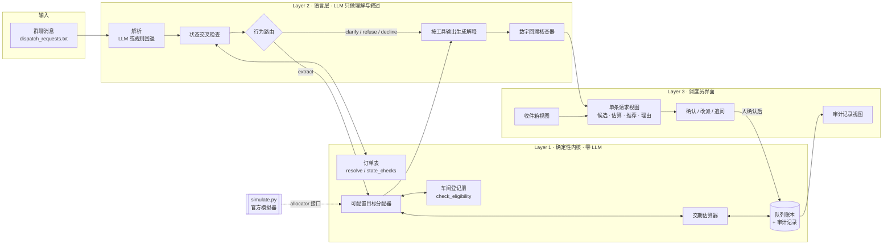

# 架构 v0（许佩瑶 · 吴杰）

GitHub 会直接渲染下面的 Mermaid 图。Sprint 1 的幻灯片版由许佩瑶据此重画。

## 接口冻结（周五）

内核对外只暴露四个入口，语言层与界面只调这四个：

| 入口 | 位置 | 签名 |
|---|---|---|
| eligible | `kernel/register.py` | `eligible_workshops(workshops, category, pieces, exclude=()) -> list[Workshop]` |
| estimate | `kernel/estimator.py` | `estimate(w, pieces, queue_days, sent_date, due_date, include_rework=True) -> Estimate` |
| rank | `kernel/allocator.py` | `Allocator(objective).rank(batch, workshops, queues, exclude=(), preference=None) -> list[dict]` |
| commit | `kernel/ledger.py` | `Ledger.commit(request_id=, order_id=, workshop_id=, ..., confirmed_by=) -> dict` |

模拟器只看到 `Allocator.__call__(batch, workshops, queues) -> workshop_id`。语言层在模拟器实验中完全不参与。
